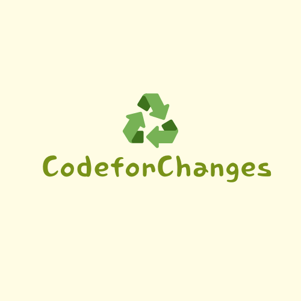

=======
[![Contributors][contributors-shield]][contributors-url]
[![Forks][forks-shield]][forks-url]
[![Stargazers][stars-shield]][stars-url]
[![Issues][issues-shield]][issues-url]
[![MIT License][license-shield]][license-url]

<!-- PROJECT LOGO -->
<br />
<div align="center">
  <a href="https://github.com/othneildrew/Best-README-Template">
    
  </a>

  <h3 align="center">Recycle Guide</h3>

   <p align="center">
    An innovative app to revolutionize recycling through technology!
    <br />
    <a href="https://github.com/CodeforChanges/recycle-frontend"><strong>Explore the docs »</strong></a>
    <br />
    <br />
    <a href="https://github.com/CodeforChanges/recycle-frontend">View Demo</a>
    ·
    <a href="https://github.com/CodeforChanges/recycle-frontend/issues">Report Bug</a>
    ·
    <a href="https://github.com/CodeforChanges/recycle-frontend/issues">Request Feature</a>
  </p>
</div>

<!-- TABLE OF CONTENTS -->
<details>
  <summary>Table of Contents</summary>
  <ol>
    <li>
      <a href="#about-the-project">About The Project</a>
      <ul>
        <li><a href="#built-with">Built With</a></li>
      </ul>
    </li>
    <li><a href="#getting-started">Getting Started</a>
      <ul>
        <li><a href="#prerequisites">Prerequisites</a></li>
        <li><a href="#installation">Installation</a></li>
      </ul>
    </li>
    <li><a href="#usage">Usage</a></li>
    <li><a href="#contributing">Contributing</a></li>
    <li><a href="#license">License</a></li>
    <li><a href="#contact">Contact</a></li>
    <li><a href="#acknowledgments">Acknowledgments</a></li>
  </ol>
</details>

<!-- ABOUT THE PROJECT -->

## About The Project

[![Product Name Screen Shot][product-screenshot]](https://github.com/CodeforChanges/recycle-frontend)

In a world increasingly concerned with sustainability, the Recycle Guide app serves as a beacon of innovation. Developed with Flutter, this app not only identifies waste types through photo recognition but also educates users on proper recycling methods. It's designed to make recycling accessible and informative, encouraging environmentally friendly practices among its users.

Why Recycle Guide?

- **Educational:** Learn how to recycle different materials properly.
- **Innovative:** Utilizes photo recognition to identify waste types.
- **Community-driven:** Share and discover recycling tips within a like-minded community.
- **Informative:** Get insights on how recycled materials can be repurposed.

We're on a mission to empower individuals to make a difference in their communities through responsible waste management. Join us in making the world a cleaner, greener place.

<p align="right">(<a href="#readme-top">back to top</a>)</p>

### Built With

This project was built with Flutter, leveraging various libraries and tools:

- [![Flutter][Flutter.io]][Flutter-url]
- [![Firebase][Firebase.io]][Firebase_url]

<p align="right">(<a href="#readme-top">back to top</a>)</p>

To get a local copy up and running follow these simple steps.

### Prerequisites

- Flutter installed on your machine
- An IDE (e.g., VSCode, Android Studio)

### Installation

1. Clone the repo

   ```sh
   git clone https://github.com/CodeforChanges/recycle-frontend.git
   ```

2. Install flutter packages

   ```sh
   flutter pub get
   ```

3. Run the app

   ```sh
   flutter run
   ```

<p align="right">(<a href="#readme-top">back to top</a>)</p>

<!-- USAGE EXAMPLES -->

## Usage

Recycle Guide can be used in several ways to promote recycling and sustainability:

Waste Identification: Snap a photo of your waste, and the app will tell you what type of material it is and how to recycle it properly.
Community Engagement: Share your recycling achievements and tips with the community, fostering a culture of sustainability.
Educational Resources: Access a wealth of information on recycling practices and the impact of recycling on the environment.

<!-- CONTRIBUTING -->

## Contributing

Contributions are what make the open-source community such an amazing place to learn, inspire, and create. Any contributions you make are greatly appreciated.

Fork the Project
Create your Feature Branch (git checkout -b feature/AmazingFeature)
Commit your Changes (git commit -m 'Add some AmazingFeature')
Push to the Branch (git push origin feature/AmazingFeature)
Open a Pull Request

<!-- LICENSE -->

## License

Distributed under the MIT License. See `LICENSE.txt` for more information.

<p align="right">(<a href="#readme-top">back to top</a>)</p>

## Contact

Project Link: [https://github.com/CodeforChanges/recycle-frontend](https://github.com/CodeforChanges/recycle-frontend)

<p align="right">(<a href="#readme-top">back to top</a>)</p>

<!-- ACKNOWLEDGMENTS -->

## Acknowledgments

- [Flutter](https:flutter.dev/)
- [Firebase](https:firebase.google.com/)
- [Choose an Open Source License](https://choosealicense.com)
- [Img Shields](https://shields.io)

<p align="right">(<a href="#readme-top">back to top</a>)</p>

[contributors-shield]: https://img.shields.io/github/contributors/othneildrew/Best-README-Template.svg?style=for-the-badge
[contributors-url]: https://github.com/CodeforChanges/recycle-frontend/graphs/contributors
[forks-shield]: https://img.shields.io/github/forks/othneildrew/Best-README-Template.svg?style=for-the-badge
[forks-url]: https://github.com/CodeforChanges/recycle-frontend/network/members
[stars-shield]: https://img.shields.io/github/stars/othneildrew/Best-README-Template.svg?style=for-the-badge
[stars-url]: https://github.com/CodeforChanges/recycle-frontend/stargazers
[issues-shield]: https://img.shields.io/github/issues/othneildrew/Best-README-Template.svg?style=for-the-badge
[issues-url]: https://github.com/CodeforChanges/recycle-frontend/issues
[license-shield]: https://img.shields.io/github/license/othneildrew/Best-README-Template.svg?style=for-the-badge
[license-url]: https://github.com/othneildrew/Best-README-Template/blob/master/LICENSE.txt
[linkedin-shield]: https://img.shields.io/badge/-LinkedIn-black.svg?style=for-the-badge&logo=linkedin&colorB=555
[product-screenshot]: assets/screenshots/screenshot.png
[Next.js]: https://img.shields.io/badge/next.js-000000?style=for-the-badge&logo=nextdotjs&logoColor=white
[Next-url]: https://nextjs.org/
[React.js]: https://img.shields.io/badge/React-20232A?style=for-the-badge&logo=react&logoColor=61DAFB
[React-url]: https://reactjs.org/
[Vue.js]: https://img.shields.io/badge/Vue.js-35495E?style=for-the-badge&logo=vuedotjs&logoColor=4FC08D
[Vue-url]: https://vuejs.org/
[Angular.io]: https://img.shields.io/badge/Angular-DD0031?style=for-the-badge&logo=angular&logoColor=white
[Angular-url]: https://angular.io/
[Svelte.dev]: https://img.shields.io/badge/Svelte-4A4A55?style=for-the-badge&logo=svelte&logoColor=FF3E00
[Svelte-url]: https://svelte.dev/
[Laravel.com]: https://img.shields.io/badge/Laravel-FF2D20?style=for-the-badge&logo=laravel&logoColor=white
[Laravel-url]: https://laravel.com
[Bootstrap.com]: https://img.shields.io/badge/Bootstrap-563D7C?style=for-the-badge&logo=bootstrap&logoColor=white
[Bootstrap-url]: https://getbootstrap.com
[JQuery.com]: https://img.shields.io/badge/jQuery-0769AD?style=for-the-badge&logo=jquery&logoColor=white
[JQuery-url]: https://jquery.com
[Flutter]: https://flutter.dev/
[Flutter.io]: https://img.shields.io/badge/Flutter-02569B?style=for-the-badge&logo=flutter&logoColor=white
[Flutter-url]: https://flutter.dev/
[Firebase]: https://firebase.google.com/?hl=ko
[Firebase_url]: https://firebase.google.com/?hl=ko
[Firebase.io]: https://img.shields.io/badge/Firebase-039BE5?style=for-the-badge&logo=Firebase&logoColor=white

> > > > > > > main
